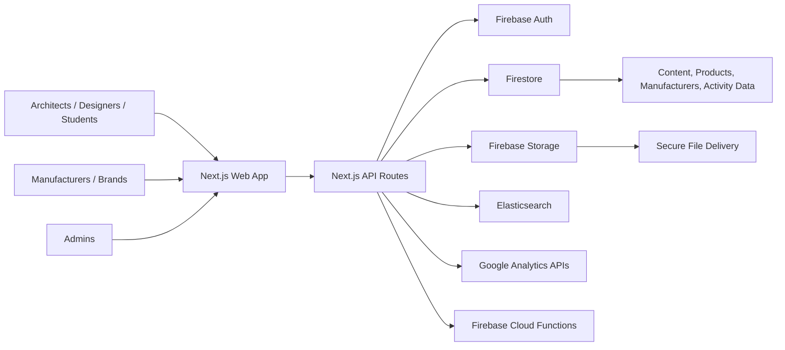

# Claude Input: Portfolio Case Study for CHAKRI

Use this file as the source of truth to build a premium portfolio page about a client project that my startup, CHAKRI, delivered for a Mexico-based client.

Do not invent metrics, awards, revenue, user counts, or timelines that are not explicitly provided here. If you want to show scale, use the verified technical scope from this repository.

## Project Identity

- Project name: BAC Modelos
- Studio/team to highlight: CHAKRI
- Client context: Mexico-based architecture / construction industry client
- Product type: BIM product discovery platform + manufacturer acquisition funnel + admin CMS + analytics dashboard
- Audience:
  - Architects
  - Designers
  - Engineers
  - Students
  - Manufacturers / brands that want to publish BIM-ready products

## One-Line Positioning

BAC Modelos is a digital platform for architects, designers, and manufacturers that combines a searchable BIM library, secure product downloads, content publishing, manufacturer onboarding, and an internal admin system for managing the full ecosystem.

## Short Portfolio Summary

With CHAKRI, we built a modern web platform for a client in Mexico focused on BIM product discovery and manufacturer visibility. The site goes far beyond a marketing landing page: it includes a public catalog, gated downloads, social login, manufacturer registration flows, editorial content, advanced admin tools, and analytics dashboards connected to real data sources.

## What Makes This Project Strong

- It is a full product platform, not a brochure site.
- It serves both public users and internal administrators.
- It combines frontend UX, backend APIs, authentication, search infrastructure, analytics, and cloud storage.
- It supports business workflows for content, manufacturers, products, resources, and user activity.
- It was built with a scalable architecture using Next.js, TypeScript, Firebase, and Elasticsearch.

## Verified Tech Stack

These details are based on the current repository snapshot.

- Frontend:
  - Next.js 16
  - React 18
  - TypeScript
  - Tailwind CSS
- UI / rich interactions:
  - D3 for analytics charts
  - TipTap rich text editor
  - React Icons
- Backend / platform:
  - Next.js App Router
  - Route Handlers under `app/api`
  - Firebase Auth
  - Firebase Firestore
  - Firebase Storage
  - Firebase Admin SDK
  - Firebase Cloud Functions
  - Elasticsearch
  - Google Analytics Data API / Admin API
- Quality / DX:
  - ESLint
  - Prettier
  - Husky
  - Docker
  - Firebase emulators for local development

## Verified Scope From The Repo

- `58` API route files
- `36` files in the admin area
- `45` component files
- `122` files under the `app` directory

These numbers are useful because they show product depth without inventing business metrics.

## Core Product Features

### Public-Facing Experience

- Dynamic homepage with hero content managed from the CMS
- Featured manufacturers and featured products
- BIM library with:
  - search
  - category filters
  - manufacturer filters
  - format filters
  - sorting
  - pagination
- Product cards with ratings, favorites, and download actions
- Manufacturer catalog and manufacturer detail pages
- Product detail and resource content structure
- Blog, articles, and video content sections
- Contact, legal, privacy, and about pages

### User Account Features

- Email/password flows
- Social login with Google and Facebook
- Profile and settings area
- Favorites
- Collections
- Followed manufacturers
- Download tracking
- Notifications and account management endpoints

### Manufacturer / Business Funnel

- Dedicated "Para Fabricantes" conversion page
- Pricing / plan presentation for manufacturers
- Manufacturer registration flow with company, contact, and account data
- Upload-oriented onboarding pattern for logos, banners, and product-related data
- Sales-oriented CTA flow for brands that want to publish BIM models

### Admin / Internal Tooling

- Manufacturer management
- Product management by manufacturer
- Content management dashboard with dedicated tabs for:
  - hero section
  - featured products
  - featured manufacturers
  - categories / subcategories
  - blog
  - blog configuration
  - resources
  - partners
  - ads
- Analytics dashboard
- Review management
- Blog comments moderation
- Legal and contact info management

## Technical Highlights Worth Showing In The Portfolio

- Hybrid rendering with Next.js App Router
- ISR on the homepage with `revalidate = 60`
- Progressive section loading using `Suspense`
- Lazy-loaded admin tabs for better performance
- Image optimization with AVIF / WebP support
- Secure file downloads gated by Firebase ID tokens
- Firestore-backed content and product data
- Elasticsearch-powered search APIs
- Google Analytics integration plus live download counts from Firestore
- Docker support and Firebase emulator workflows for local development

## Performance / Engineering Notes

Use these as portfolio talking points:

- Homepage sections stream progressively instead of blocking the full page.
- Library pages implement filtering, pagination, preload behavior, and retry logic for network resilience.
- Admin content tabs are lazy-loaded to reduce initial bundle cost.
- The app is structured as a real product codebase, not a single-page marketing site.
- Search is separated into dedicated API handlers and Elasticsearch helpers.

## Suggested Portfolio Page Structure

Build a single polished case-study page with these sections:

1. Hero
2. Project overview
3. Challenge
4. Solution
5. Feature highlights
6. Tech stack
7. Architecture / system overview
8. Admin and CMS capabilities
9. Why this project matters
10. Closing CTA linking the work back to CHAKRI

## Suggested Hero Copy

### Headline

Engineering a BIM platform for discovery, downloads, and manufacturer growth

### Subheadline

For BAC Modelos, CHAKRI delivered a modern Next.js platform that combines searchable product catalogs, secure file delivery, content management, manufacturer onboarding, and analytics into one scalable web product.

### Hero Supporting Points

- Built for a client in Mexico
- Full-stack platform, not just marketing pages
- Search, auth, CMS, analytics, and cloud infrastructure in one codebase

## Suggested "Challenge" Copy

The client needed more than a polished website. They needed a platform that could serve architects and designers looking for BIM-ready products, while also creating a business funnel for manufacturers who wanted visibility, analytics, and a structured publishing workflow. That meant balancing public UX, internal operations, gated downloads, content publishing, and long-term scalability.

## Suggested "Solution" Copy

CHAKRI designed and built BAC Modelos as a multi-surface digital product. On the public side, users can browse manufacturers, explore a BIM library, search and filter products, read editorial content, and access gated downloads. On the business side, manufacturers have a dedicated acquisition path, and administrators can manage hero content, featured inventory, categories, blog content, resources, and analytics through a custom dashboard.

## Suggested Feature Highlight Cards

- Searchable BIM Library
  - Advanced filtering, product discovery, pagination, and manufacturer-aware search.
- Secure Downloads
  - Authenticated download flow protected with Firebase tokens and server-side checks.
- Manufacturer Growth Funnel
  - Dedicated pages and onboarding flows designed to convert brands into platform participants.
- Content and Resource Publishing
  - Blog, resources, featured sections, and homepage content managed from the admin side.
- Admin Dashboard
  - Internal tooling for content operations, manufacturer management, product management, and moderation.
- Analytics Layer
  - GA-connected dashboards with visual charts and live Firestore-backed activity counts.

## Suggested "Tech Stack" Copy

This platform was built with Next.js 16, React 18, TypeScript, and Tailwind CSS on the frontend, with Firebase handling authentication, Firestore data, storage, and supporting cloud services. Search was extended with Elasticsearch, while analytics combined Google Analytics APIs with application-level tracking.

## Suggested "Architecture" Copy

The application uses a modern App Router setup with server and client rendering patterns, route handlers for backend functionality, Firebase for core platform services, and Elasticsearch for search. The result is a codebase that supports both fast user-facing experiences and a sizable operational backend for the client team.

## Suggested "Why It Matters" Copy

What makes this project strong is its breadth. It is not just visually polished; it is operationally useful. It supports content, catalog management, brand onboarding, gated resources, analytics, and user workflows in a single cohesive platform. That is the kind of build that demonstrates product thinking, not just web design.

## Design Direction For The Portfolio Page

- Make it feel premium, technical, and product-focused.
- Avoid generic agency-site styling.
- Use a clean editorial layout with large headings, strong spacing, and dark text on light backgrounds.
- Keep the look contemporary and architectural.
- Use blue accents inspired by the client brand.
- Let the page feel like a case study for a serious platform, not a dribbble shot.

## Brand / Color Direction

Use the existing project palette as inspiration:

- Deep blue: `#0054A3`
- Bright blue: `#0366BB`
- Navy-blue text: `#2C5A84`
- Light background: `#F7FAFC`
- Soft accent background: `#E5EDF5`

## Architecture Diagram

## Visual References Available In The Repo

If image rendering from local paths is supported, use these assets directly. If not, recreate the same visual mood and reference them conceptually.

- Logo: `../public/assets/production/logoWeb.png`
- Hero background: `../public/assets/figma/hero-bg.png`
- Example product imagery:
  - `../public/assets/figma/product-1.png`
  - `../public/assets/figma/product-3.png`
  - `../public/assets/figma/product-4.png`
- Example manufacturer imagery:
  - `../public/assets/figma/manufacturer-1.png`
  - `../public/assets/figma/manufacturer-4.png`
  - `../public/assets/figma/manufacturer-10.png`
- Example blog/editorial imagery:
  - `../public/assets/figma/blog-post-1-v2.png`
  - `../public/assets/figma/blog-post-4-v2.png`
  - `../public/assets/figma/blog-post-6-v2.png`

## Optional Embedded Visuals

## Final Instruction To Claude

Create a single standout portfolio case-study page for CHAKRI using the content above. The page should communicate that this was a serious full-stack product for a real client in Mexico, with strong engineering depth, polished UX, and meaningful business workflows. Keep the copy confident and concise, and do not fabricate outcomes that are not in this document.
